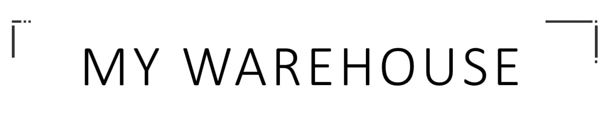

    

My Warehouse - приложение для консолидации информации по входящим поставкам на склад, 
с возможностью анализа загруженности в режиме онлайн  и планирования будущих поставок на склад.

[comment]: <> ([![Build Status]&#40;https://safeworks.ru/badge.svg&#41;]&#40;https://github.com/egorbarinov/commandProject/tree/Dev5&#41;)
[comment]: <> ([![Build Status]&#40;https://safeworks.ru/badge.svg&#41;]&#40;https://github.com/ZettroMan/warehouse/tree/dev&#41;)

Обзор
------------
- Приложение состоит их двух : Backend и Frontend.
  - Backend: Имеет монолитную архитектуру и реализован на следующем стеке технологий:
    - Java Core, 11th Ed;
    - SpringBoot Framework - мощный фреймворк для быстрого развертывания Web-приложений;
    - Spring Security - фреймворк, который сфокусирован на обеспечение как аутентификации, так и авторизации в Java-приложениях;
    - JWT - для безопасного взаимодействия backend и frontend посредством генерации токенов аутентификации;
    - Hibernate - для взаимодействия с базой данных;
    - JUnit5, Mockito  - для покрытия тестами кода проекта;
    - Sentry - мощный инструмент, который обеспечивает качественное ведение логгирования работы приложения, с сохранением результата в log-файл и отправкой его на электронную почту;
    - Swagger - это фреймворк и спецификация для определения REST APIs в формате, дружественном к пользователю и компьютеру (JSON или YAML);
    - FlyWay Migration - библиотека для быстрого развертывания или обновления базы данных на основе SQL- запросов; 
    - Apache POI - популярный API, который позволяет программистам создавать, изменять и отображать файлы MS Office с помощью программ Java ;
    - PostgreSQL - свободно распространяемая объектно-реляционная система управления базами данных (СУБД), наиболее развитая из открытых СУБД в мире и являющаяся реальной альтернативой коммерческим базам данных.
  - Frontend:
    - Node.js — программная платформа, основанная на движке V8 (транслирующем JavaScript в машинный код), превращающая JavaScript из узкоспециализированного языка в язык общего назначения;
    - Angular - Открытая и свободная платформа для разработки веб-приложений, написанная на языке TypeScript, разрабатываемая командой из компании Google, а также сообществом разработчиков из различных компаний.

Установка
------------
- Для работы приложения требуется база данных PostgreSQL;
- Для быстрого развертывания базы данных можно воспользоваться FlyWay Migration;
- Дополнительно реализована возможность автоматической генерации таблиц посредством фреймворка Hibernate.

Сообщество
---------
- Следуйте за нами на [GitHub(Backend)](https://github.com/egorbarinov/commandProject/tree/Dev5),
  и [GitHub(Frontend)](https://github.com/ZettroMan/warehouse/tree/dev).

---

    

My Warehouse is an application for consolidating information on incoming shipments to the warehouse, with the ability to analyze workloads online and plan future deliveries to the warehouse.

OverView
------------
- The application consists of two main parts: Backend and Frontend.
  - Backend has a monolithic architecture and is implemented on the following technology stack:
    - Java Core, 11th Ed;
    - Spring Boot Framework - powerful framework for quickly deploying Web applications;
    - Spring Security - framework that focuses on providing both authentication and authorization in Java applications;
    - JWT - authentication technology that provides secure interaction between backend and frontend by generating authentication tokens;
    - Hibernate - for interacting with the database;
    - JUnit5 and Mockito - frameworks that helps to cover the project code with tests;
    - Sentry - powerful tool that provides high-quality logging of the application's operation, saving the result to a log file and sending it to e-mail;
    - Swagger - framework and specification for defining REST APIs in a user- and computer-friendly format (JSON or YAML);
    - FlyWay Migration - library for quick database deployment or updating based on SQL queries;
    - Apache POI - popular API that allows programmers to create, modify and display MS Office files using Java programs.
  - Frontend is implemented on the following technology stack:
    - Node.js - software platform based on the V8 engine (translating JavaScript into machine code) that transforms JavaScript from a highly specialized language into a general-purpose language;
    - Angular - an open and free web application development platform written in TypeScript, developed by a team from Google, as well as a community of developers from various companies. 

Installation
------------
- The application requires a PostgreSQL database;
- For quick database deployment, you can use FlyWay Migration;
- In addition, the Hibernate framework provides a Code First approach to automatically create all tables in a database.

Community
---------
- Follow us on [GitHub(Backend)](https://github.com/egorbarinov/commandProject/tree/Dev5),
  and [GitHub(Frontend)](https://github.com/ZettroMan/warehouse/tree/dev).
